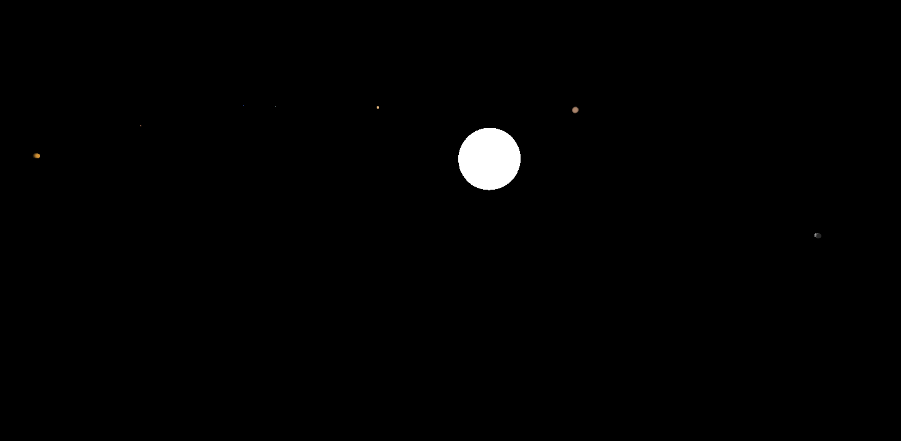

# gravity-simulator

3-Dimensional Realistic Gravity Simulator, written in C++ using SDL and OpenGL.

# Installation

This project requies the g++ compiler to be installed.

1. ``git clone LINK --recursive``
2. ``cd gravity-simulator``
3. If you did not do ``--recursive`` during ``git clone``, run ``git submodule update --init --recursive``
4. In ``./src/external/``, run ``install-libs-OS.ex`` for your operating system
5. ``make`` / ``Mingw32-make`` (windows) to build and run, or ``make build`` to just build the executable

Note: Linux currently does not build yet, as it requires some work inside the console thread.

# Usage

Once running, the program launches 4 threads:
* main (window input)
* Physics
* Render
* Console

Within the main window, use WASD to move around in the XY plane, SPACE/LCTRL to move in the Z plane, and the arrow keys to change viewing angle (will likely be changed to mouse).

In the terminal, type ``help`` to see a list of commands.

Some important commands:
* ``get / set``: get or set important variables or object values
* ``lock / unlock``: lock the camera position relative to a body
* ``add [name] / remove [name]``: add or remove bodies

Once opened, the program initializes with spawning our solar system with appropriate sizes, distances, and velocities.
It spawns the sun, Mercury to Neptune, as well as the moon.
The radii are 100x larger, with the exception of the sun's radius being 10x larger.
The time scaling is initialized to one week per second.

The camera is initialized to going 1000x the speed of light.

Note: the moon does spawn, but with Earth at its scaled size, it is inside the Earth (no collision).

This project is still being developed and will probably have major changes.